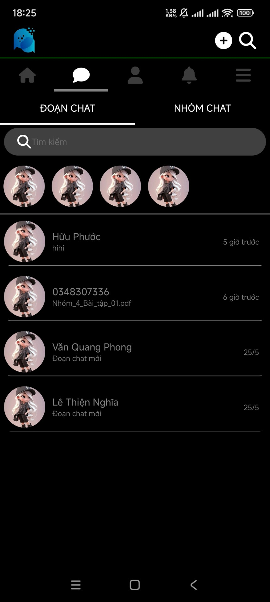
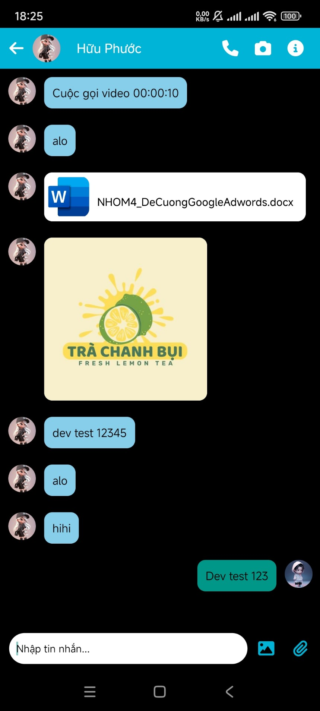

# WELLCOME TO SECOM APP 
   ## This is a social networking platform that helps people connect and share with each other moments in life
   

## Feature : 

   - Sign up and log in
     
      
      
      
   - Post status
     
      
      

   - Chat

     
     
     

   - Profile

     
     
     

   - Setting app

     

   # Download

   To download the app, please go to google play or app store, find SeCom and download

   # Dev
   ## Step 1 : Clone this repository
   ```bash
   git clone https://github.com/CNM-SeCom/MobileSeCom
   ```
   ## Step 2: Start your Application  
   Let Metro Bundler run in its _own_ terminal. Open a _new_ terminal from the _root_ of your React Native project. Run the following command to start your _Android_ or _iOS_ app:

   ### For Android
   
   ```bash
   # using npm
   npm run android
   
   # OR using Yarn
   yarn android
   ```
   
   ### For iOS
   
   ```bash
   # using npm
   npm run ios
   
   # OR using Yarn
   yarn ios
   ```
   # Congratulations! :tada:

   You've successfully run
